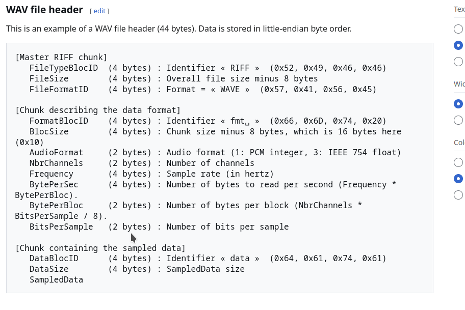
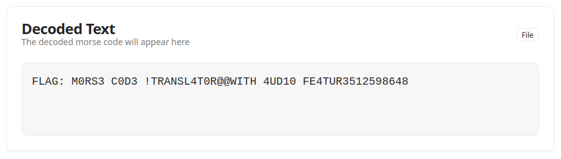

# Sound #

## Description ##
Analyze the file: `Note.txt`

## Approach ##
Let's analyse `Note.txt` with following command:

```bash
└──╼ $file Note.txt 
Note.txt: Unicode text, UTF-8 text, with very long lines (65532), with no line terminators
```

`Note.txt` contain text. If we open the file, we can see that, it contains hexa characters.

According to the challenge title `Sound`, we can think that `Note.txt` hides a audio file. So, we can try to convert hexadecimal characters in this file in order to obtain a audio file(wav format in this case).

```bash
└──╼ $grep -oE '[0-9A-Fa-f]{2}' Note.txt | tr -d '\n' | xxd -r -p > Note.wav
(my_env) ┌─[belmar@parrot]─[~/Desktop/nextgen/forensics]
└──╼ $file Note.wav 
Note.wav: data
(my_env) ┌─[belmar@parrot]─[~/Desktop/nextgen/forensics]
└──╼ $hexdump -C Note.wav | head -n 15
00000000  52 49 6c 26 05 00 10 00  00 00 01 00 01 00 40 1f  |RIl&..........@.|
00000010  00 00 40 1f 00 00 01 00  08 00 64 61 74 61 48 26  |..@.......dataH&|
00000020  05 00 80 83 91 ab cb e3  ec df bd 8d 58 2b 0c 04  |............X+..|
00000030  14 37 69 9e ce f0 fc f2  d3 a5 70 3e 18 05 09 23  |.7i.......p>...#|
00000040  4e 82 b6 e0 f8 fa e6 bf  8d 58 2a 0d 04 12 35 65  |N........X*...5e|
00000050  9a ca ed fc f4 d7 a9 74  42 1a 06 08 20 49 7d b1  |.......tB... I}.|
00000060  dc f7 fb e9 c3 92 5d 2e  0e 04 10 31 60 95 c6 eb  |......]....1`...|
00000070  fc f6 da ae 79 46 1d 07  07 1d 45 78 ad d9 f5 fc  |....yF....Ex....|
00000080  eb c8 96 61 32 11 04 0e  2d 5b 90 c2 e8 fb f7 dd  |...a2...-[......|
00000090  b2 7e 4a 20 08 06 1a 41  73 a8 d6 f3 fc ee cb 9b  |.~J ...As.......|

```

We can see that the resulting file is not a wav file (data). Normally, wav chunks starts with : `RIFFl&..WAVEfmt`. So, we can conclude that `Note.txt` is corrupted. By opening Note.txt, we have seen that it contains at begin "❌❌", meaning that, some characters are missing. We need to fix it. We can do that we python script or using [HexEd.It](https://hexed.it/) to fix the headers. I opted for the python method. To do this we need to know wav file format; we can use [Wikipedia](https://en.wikipedia.org/wiki/WAV) for it:



So, we can use the following script:

```python
import sys, struct
fp = open('Note.wav','rb').read()

# finding 'data' chunk
i = fp.find(b'data')
if i == -1:
    print('Error: chunk "data" not found in file')
    sys.exit(1)

# Reading chunk size (little-endian)
data_size = int.from_bytes(fp[i+4:i+8], 'little')
data_start = i + 8
data = fp[data_start:data_start+data_size]

if len(data) != data_size:
    print(f'Warning: Expected size {data_size}, but {len(data)} found.')

# audio parameters
nchannels = 1
samplerate = 8000
bits_per_sample = 8
byte_rate = samplerate * nchannels * (bits_per_sample // 8)
block_align = nchannels * (bits_per_sample // 8)
subchunk1_size = 16
audio_format = 1  # PCM 

# constructing header
riff_size = 36 + len(data)
header = b'RIFF' \
         + riff_size.to_bytes(4,'little') \
         + b'WAVE' \
         + b'fmt ' \
         + subchunk1_size.to_bytes(4,'little') \
         + audio_format.to_bytes(2,'little') \
         + nchannels.to_bytes(2,'little') \
         + samplerate.to_bytes(4,'little') \
         + byte_rate.to_bytes(4,'little') \
         + block_align.to_bytes(2,'little') \
         + bits_per_sample.to_bytes(2,'little') \
         + b'data' \
         + len(data).to_bytes(4,'little')

open('fixed_Note.wav','wb').write(header + data)
```
This program produced the fixed wav audio. We can see that, the header is correct this time:

```bash
└──╼ $python3 fixe_Note.py 
(my_env) ┌─[belmar@parrot]─[~/Desktop/nextgen/forensics]
└──╼ $file fixed_Note.wav 
fixed_Note.wav: RIFF (little-endian) data, WAVE audio, Microsoft PCM, 8 bit, mono 8000 Hz
(my_env) ┌─[belmar@parrot]─[~/Desktop/nextgen/forensics]
└──╼ $hexdump -C fixed_Note.wav | head
00000000  52 49 46 46 6c 26 05 00  57 41 56 45 66 6d 74 20  |RIFFl&..WAVEfmt |
00000010  10 00 00 00 01 00 01 00  40 1f 00 00 40 1f 00 00  |........@...@...|
00000020  01 00 08 00 64 61 74 61  48 26 05 00 80 83 91 ab  |....dataH&......|
00000030  cb e3 ec df bd 8d 58 2b  0c 04 14 37 69 9e ce f0  |......X+...7i...|
```

If we listen the audio file, we can hear beeps(short and long beeps). So, we can suspect `morse code`. We can try to decode it with many online tools such as : [MorseXpress](https://morsexpress.com/morse-code-audio-decoder/) and will find the flag:

